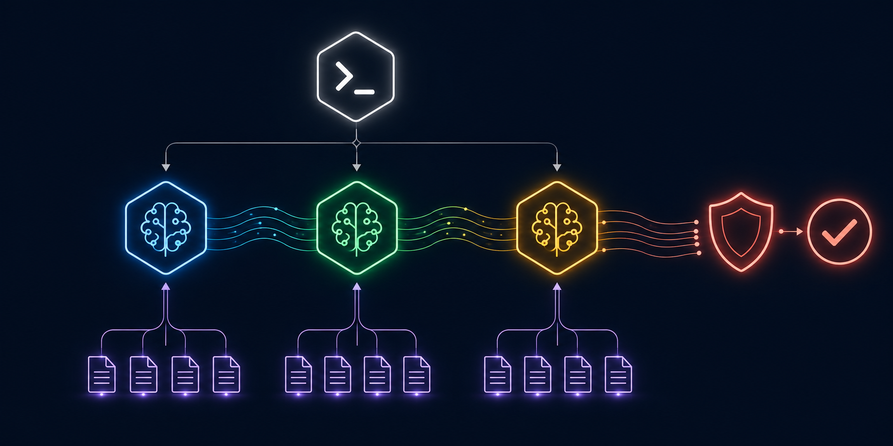

# Multi-Agent Orchestration Framework



**Patterns for running AI agents in parallel - faster delivery, isolated contexts, clean results.**

[](LICENSE)
[](#patterns)

---

## Problem

A single AI agent handling everything is slow and context-heavy. When a task has independent parts, sequential execution wastes time. When agents share context, they interfere with each other.

## Solution

Six orchestration patterns for parallel multi-agent execution. Each pattern solves a specific coordination problem: dispatch, parallelism, isolation, review, and escalation.

---

## Three-Tier Dispatch

The core architecture. Separates concerns into three layers with clear contracts:

```
Command (/slash-cmd)
  -> Agent (spawned with scoped role + context)
    -> Skill (methodology injected into agent context)
```

| Tier | Role | Contract |
|------|------|----------|
| **Command** | User-facing entry point | Minimal logic, parses input, dispatches |
| **Agent** | Isolated execution unit | Scoped context, returns conclusion only |
| **Skill** | Reusable methodology | Loaded into agent context as instructions |

### Why Three Tiers?

- **Commands** are stable interfaces users rely on - they don't change when the implementation does
- **Agents** are disposable workers - spawn, execute, return result, die
- **Skills** are reusable across agents - write once, apply to any agent that needs it

---

## Parallel Wave Execution

Split independent work into concurrent waves. Each wave completes before the next starts.

```
Wave 1 (parallel - all at once):
  Agent A -> analyze source 1
  Agent B -> analyze source 2
  Agent C -> analyze source 3

Wave 2 (depends on Wave 1):
  Main agent -> synthesize A+B+C conclusions
```

### Rules

- Each agent gets ONLY the context it needs - not the full codebase
- Each agent returns ONLY the conclusion - not the reasoning trail
- Main loop stays 30-40% full by delegating intermediate work
- One atomic commit per agent task - clean git history

### When to Use Waves

| Situation | Wave pattern |
|---|---|
| Analyze 5 files independently | Wave 1: 5 parallel analyzers. Wave 2: synthesize |
| Build frontend + backend | Wave 1: parallel builds. Wave 2: integration test |
| Research 3 topics | Wave 1: 3 researchers. Wave 2: compare and summarize |
| Code review + test + lint | Wave 1: all 3 in parallel. Wave 2: aggregate results |

---

## Git Worktree Isolation

Run multiple agents on the same repo without merge conflicts.

```bash
# Create isolated workspace for each agent
git worktree add .worktrees/feature-auth feature-auth
git worktree add .worktrees/feature-api feature-api

# Agent A works at .worktrees/feature-auth
# Agent B works at .worktrees/feature-api
# No conflicts - each has its own working directory + branch

# Merge when done
git worktree remove .worktrees/feature-auth
git worktree remove .worktrees/feature-api
```

### Benefits

- Multiple agents work concurrently on the same repository
- No context pollution between work streams
- Each worktree = independent working directory + independent branch
- Standard git merge resolves any overlapping changes

---

## Cross-Model Routing

Not every subtask needs the same model. Route each agent to the cheapest model that handles it well.

| Task type | Model | Latency | Cost |
|---|---|---|---|
| Simple transforms, extraction | Agent Booster (no LLM) | <1ms | Free |
| Summarization, broad reading | Gemini | ~1s | Low |
| Focused coding, tests | GPT Codex | ~2s | Low-Med |
| Complex reasoning, debugging | Sonnet | ~3s | Medium |
| Architecture, security | Opus | ~5s | High |

### Escalation Rule

Escalate only once per level. If the lower tier returns an error or can't handle the task, move up one tier. Don't jump from Haiku to Opus - try Sonnet first.

```
Agent attempts task with assigned model
  -> Success: return result
  -> Failure/Uncertainty: escalate one tier up
    -> Success: return result
    -> Still uncertain: explain what's unclear
```

---

## Two-Stage Review Gate

Before merging any agent output, run two independent checks:

### Stage 1: Spec Compliance
- Does the output match the original specification?
- Are all success criteria met?
- Did the agent stay within scope?

### Stage 2: Code Quality
- Is the code clean and minimal?
- No unintended scope creep?
- No security vulnerabilities introduced?

Both stages must pass before the output is integrated. If either fails, the agent gets specific feedback and retries.

### Why Two Stages?

An agent can write clean code that doesn't match the spec (Stage 1 catches this). An agent can match the spec with messy code (Stage 2 catches this). Checking both prevents shipping wrong-but-clean or correct-but-messy work.

---

## Observer Loop Prevention

When agents can spawn sub-agents, prevent infinite recursion:

1. **Unique IDs** - each agent has a unique identifier and scoped task
2. **No self-spawning** - an agent never re-spawns itself for the same task
3. **Max depth: 3** - hard limit on nesting levels
4. **Duplicate detection** - main loop monitors for repeated task IDs

```
Main Agent
  -> Sub-Agent A (depth 1)
    -> Sub-Sub-Agent A1 (depth 2)
      -> Sub-Sub-Sub-Agent A11 (depth 3) <- MAX, no further spawning
```

---

## Golden Rule: One Message, All Operations

All related operations MUST run concurrently in a single dispatch:

```
# Correct - all agents dispatched in one message
dispatch([
  Agent("analyze auth module"),
  Agent("analyze API module"),  
  Agent("analyze database module"),
])
# Wait for all completions, then synthesize

# Wrong - sequential dispatch wastes time
dispatch(Agent("analyze auth module"))
wait()
dispatch(Agent("analyze API module"))
wait()
dispatch(Agent("analyze database module"))
wait()
```

---

## Anti-Patterns

| Anti-pattern | Problem | Fix |
|---|---|---|
| Fat agent context | Agent gets full codebase when it needs 2 files | Scope context to exactly what the task requires |
| Chatty agents | Returns reasoning trail instead of conclusion | Return ONLY the conclusion, keep reasoning internal |
| Sequential when parallel | Doing A then B when they're independent | Use wave execution |
| Skipping review gate | Integrating output without spec+quality check | Always run two-stage review |
| Single-wave everything | Not splitting independent work streams | Identify independent subtasks, parallelize them |
| Unbounded spawning | Agents spawn agents without depth limits | Set max depth and duplicate detection |

---

## File Structure

```
multi-agent-orchestration/
  README.md                           # This file
  patterns/
    three_tier_dispatch.md            # Command -> Agent -> Skill
    parallel_waves.md                 # Wave execution pattern
    git_worktree_isolation.md         # Concurrent repo access
    cross_model_routing.md            # Multi-model task routing
    review_gate.md                    # Two-stage quality gate
    loop_prevention.md                # Anti-recursion safeguards
  examples/
    code_review_pipeline.md           # 3-agent parallel code review
    feature_build.md                  # Frontend + backend parallel build
```

---

## License

Apache 2.0 - see [LICENSE](LICENSE) for details.
